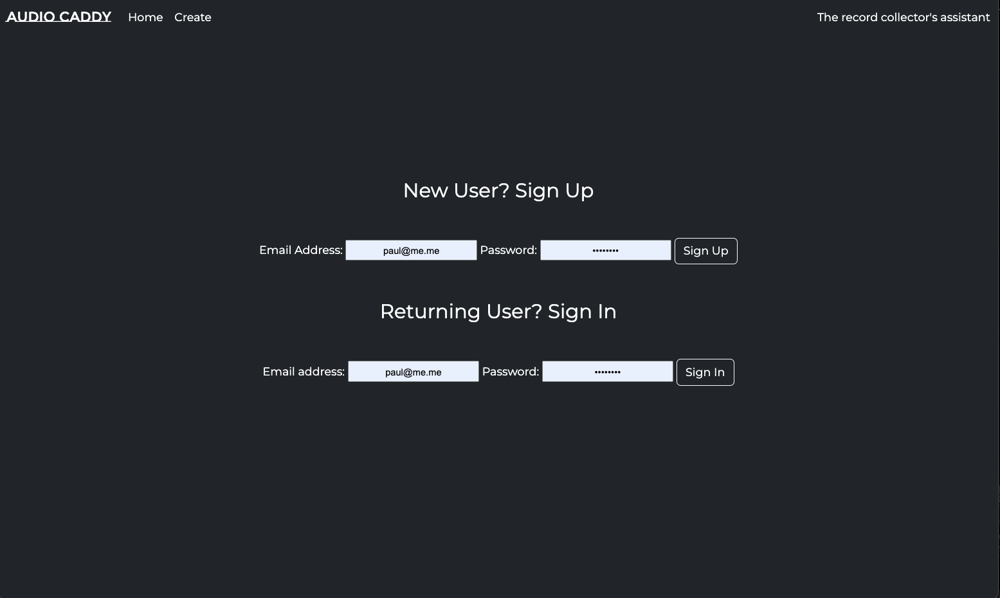
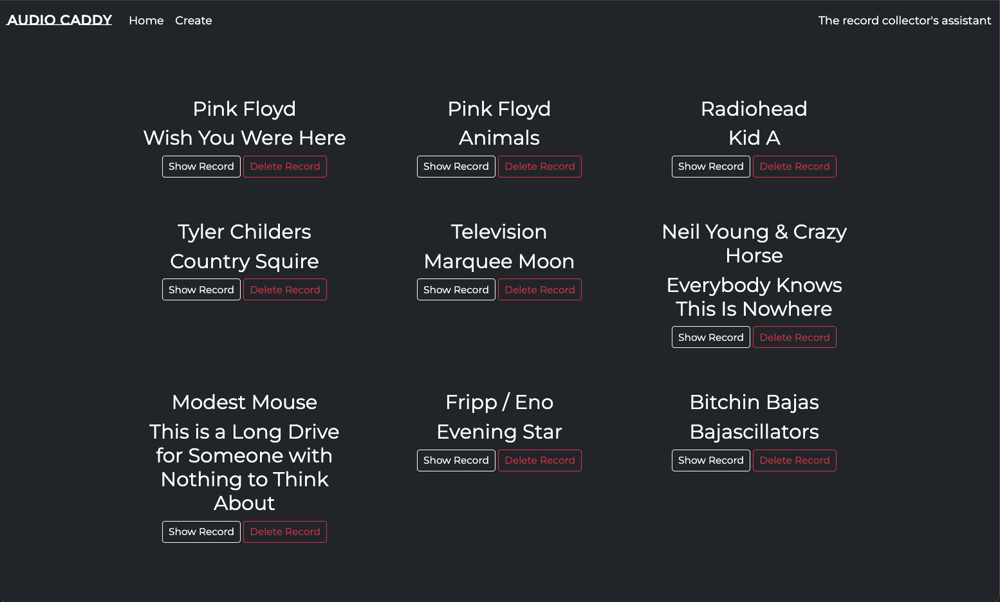
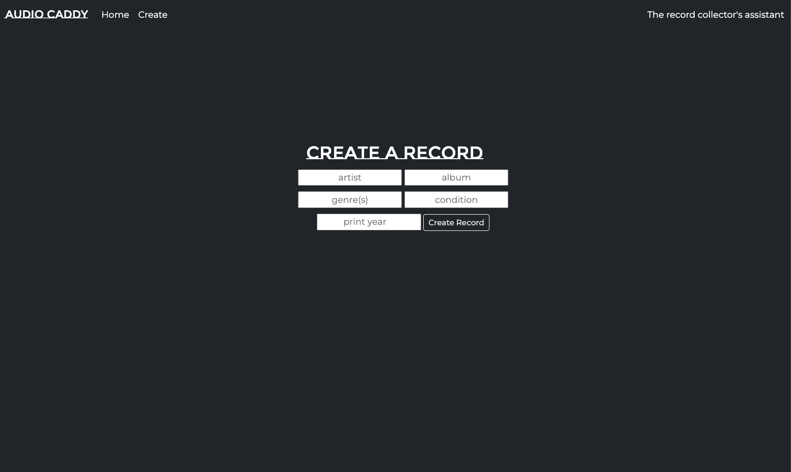
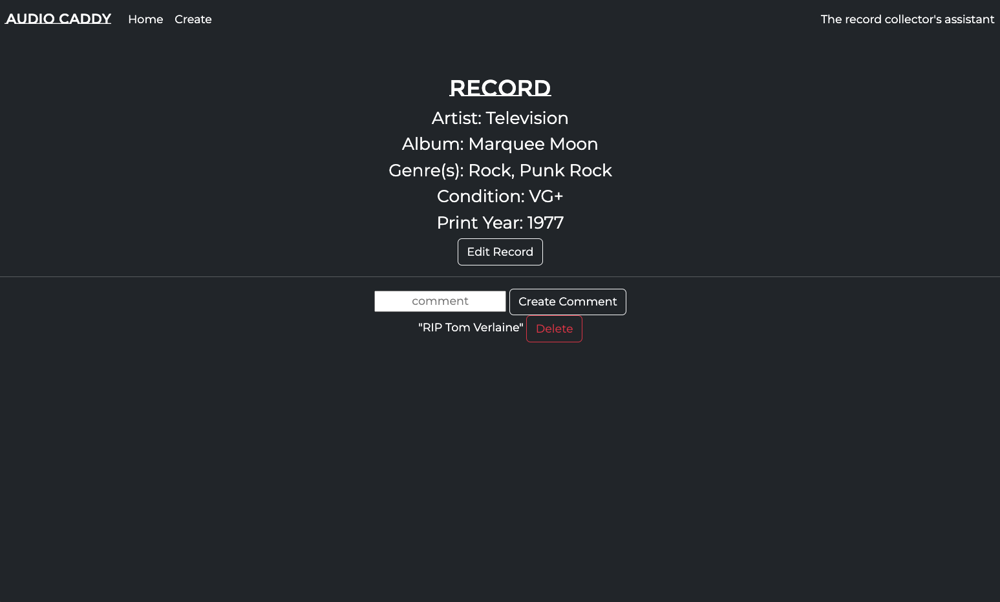
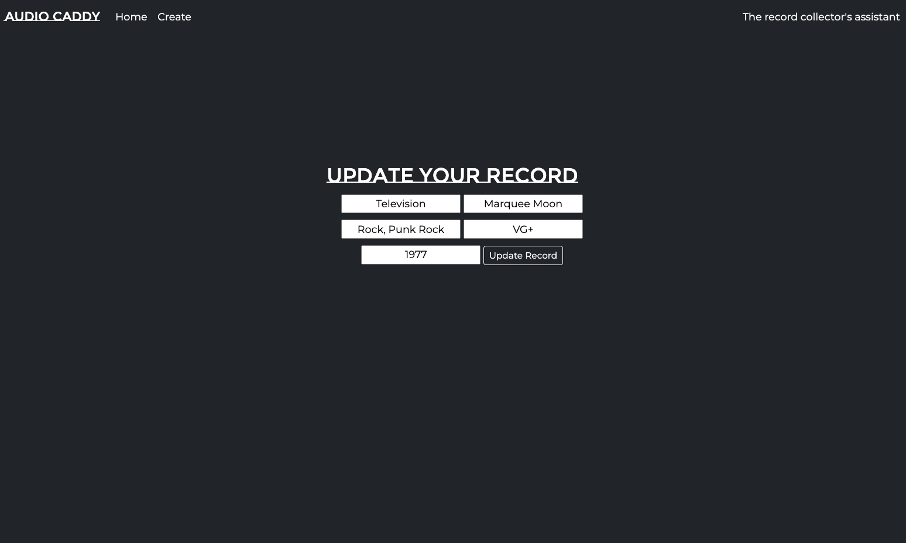

# Audio Caddy - The record collection tracker

Keep track of your record collection! I am an avid record collector, and I thought it would be fun to have a simple collection tracker so I can always have access to my collection. Sometimes when you are on the go and you are shopping for new records you may forget if you already have a record in your collection, and this app will be there to prevent that from happening.

## Technologies Used
- HTML
- CSS
- JavaScript
- Bootstrap

## Getting Started

The first view is the authentication view, where a user will be prompted to sign in or sign up. I they do not have an account already, they can sign up. Once the account is created, they will be prompted to sign in. 

Once a user successfully signs in, they will be brought to the 'home page' view, which is an index all records in that user's collection. The user can return to this view at any time by pressing "Home" in the Nav Bar. 

If this is a new user, they will have to create a record to add it to their collection, which they can do by clicking the "create" button in the nav bar. This will bring up the input fields where they will add artist, album, etc, and the record will be created once they click the 'create record' button. Once the record is created, the user will be notified and sent back to the "Home Page" view, where they can see their collection with the new record added.

Each record in the collection has a 'show record' button and a 'delete record' button. The delete button is self explanatory, it will delete the record from the collection. The 'show record' button will, when clicked, change to the 'show record' view. In this view the user can see the details of the record, including comments, which can be added and deleted directly from the 'show record' view. 

The 'edit record' button will send them to the 'edit' view, which is similar to the 'create' view, but it will have the current record details populated in the input boxes. Clicking 'update record' will update the record and send the user back to the 'home page' view.

## Next Steps

- Version 2
    - I want the ability to create instances of other forms of physical media in my collection, like cds, tapes, audiobooks.
    - I want the ability for other users to view, share, and comment on each other's collection because it's fun to share your opinion with others.
    - I want an image to display for my collection entries because often album art is quite spectacular.
    - I want to be able to search for a record in my collection.
    - I want the records to index in alphabetical order by artist.
    - I want to implement a sign-out feature.
- Version 3
    - I want to be able to share my collection with someone because I think I have some cool stuff and I want everyone to know about it.
    - I want to be able to upload recordings of my records because I would like to listen to them on the go.
    - I want to be able to sell my records and other audio to other users because one day I may have too many copies.